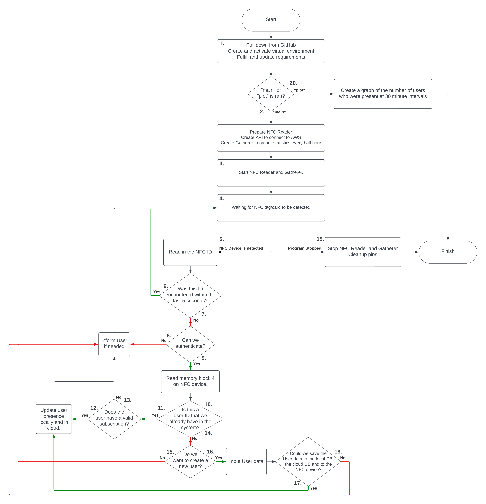

# KapU - Entry Control System

## Summary

This is the GitHub Repository for KapU, a Fourth Year Project developed by Máté Domonics, studying at SETU Waterford. The project is an entry-control system, allowing for adding users, updating their presence, and only allowing entry to users with a valid subscription. Additionally, a graph can be presented to see the amount of users present in the facility at a given time, aiding with data analysis.

The project utilizes a Raspberry Pi that scans an NFC tag and gains info from it. Additionally, the project also writes to NFC tags when prompted, therefore caution should be practiced when running this program near any card or device that has NFC capabilities.

Using the information from the NFC tags, the project is integrated with an AWS API Gateway, which is connected to a Lambda Function. The API Gateway secures access to the Lambda Function via a REST API, and the Lambda Function interprets the different types of requests the program sends to the API Gateway and makes changes to the DynamoDB database accordingly.

Once these are achieved, the program displays whether a user is allowed into the facility or not, depending on if they have a valid subscription.

### [Official GitHub Pages Website](https://matedomonics.github.io/entry-control-system/)

## User Setup

### Raspberry Setup

1. Run the following commands to set up your Raspberry Pi:
```sudo apt update ; sudo apt upgrade -y```

2. Turn on I2C on your Rapsberry Pi.
```sudo raspi-config```:

    ```Interfacing Options > I2C > Yes```

3. Install the dependent packages for I2C:
```sudo apt-get install libusb-dev libpcsclite-dev i2c-tools```

4. Reboot the Raspberry Pi:
```sudo reboot```

### Hardware Setup

1. Set the dip switches on the PN532 NFC HAT to correspond with the table below:

    |      | OFF | ON |
    |:----:|:---:|:--:|
    | SCK  |  X  |    |
    | MISO |  X  |    |
    | MOSI |  X  |    |
    | NSS  |  X  |    |
    | SCL  |     |  X |
    | SDA  |     |  X |
    | RX   |  X  |    |
    | TX   |  X  |    |

2. Set the jumpers according to the table below, based on I2C:

    |      | I1  | I0  |
    |:----:|:---:|:---:|
    | UART |  L  |  L  |
    | I2C  |  L  |  H  |
    | SPI  |  H  |  L  |

### Software Setup

1. Clone the repository onto a Raspberry Pi which has been set up with the capability to run a PN532 NFC HAT Module.
```git clone https://github.com/MateDomonics/entry-control-system.git```
2. Navigate into the ```entry-control-system``` folder.
3. Fill in the info for ```aws_access``` in the ```data``` folder of the project path and place your API key into it.
4. Fill in the info for ```environment``` in the ```data``` folder of the project path and place the name of your table on DynamoDB into it **(Case- and spelling sensitive)**.
5. Run the `start.sh` bash script with the following parameters: either ```main```  (start the NFC Reader) or ```plot``` (to plot statistics).

    This will check for updates on GitHub, initialise a python virtual environment, fulfill dependencies and run the program automatically.

## Developer Log

### January 2nd, 2024

- Set up project.
- Created the initial, concept version of the project based on the [pn532pi library](https://pypi.org/project/pn532pi/).
- Fried the first NFC HAT module, so there also was a workaround implemented temporarily to show that the code theoretically worked.

### January 21st, 2024

- Abandoned the pn532pi libray due to many difficulties with it. Instead, I found another GitHub repo that seemed similar to the library, and I took the `i2c.py` and `pn532.py` files from it as a base.
- Implemented python virtual environments to help with running the program.

### January 26th, 2024

- Cleaned up the code to fully remove code that depended on the python library.
- Fixed dependencies for the project.
- Implemented the scanning successfully with most NFC-based devices.
- Experimented with writing to NFC tag, unsuccessful.

TO-DO:

- Can't scan NFC tag that came with Raspberry Pi. &#x2714;

### February 9th, 2024

- GitHub Pages website implemented.

### February 18th, 2024

- Fixed issue with not being able to scan NFC tags that came with Raspberry Pi.
- Created bash script that automatically creates a virtual environment if not present and switches to it.
- Fixing imports, adding comments.
- Implemented the ability to write to NFC Tags.
- Wrote documentation in `README.md`, which will be kept up-to-date from now on.
- Merged `proof-of-concept` branch to `main`

TO-DO:

- Move on from using fake users to test writing and reading to actually using DynamoDB on AWS. &#x2714;

### February 25th, 2024

- Made sure to NOT upload my AWS credentials to GitHub like an idiot.
- Added the ability to create a new user on DynamoDB using the program.
- Added the ability to get a user from DynamoDB.
- Tried to implement the ability to update a user on DynamoDB. (Doesn't work yet.)
- Fixed a GPIO warning that was thrown everytime because no cleanup was done.
- Reduced print statements to prepare for a "release build".

TO-DO:

- Boto3 documentation is absolutely shocking, so the update method still doesn't work. Try figure it out. &#x2714;

### April 5th, 2024

Developer Note: Don't be scared by the huge gap in commits, most of my time was spent trying to figure out how Cognito User Pools worked before I realised that it's useless and I'm better off using API keys. Thank you John for pulling me out of that cursed rabbit hole.

- Moved away from Boto3 to make use of API Gateway and Lambda Functions
- Also moved away from using AWS Access Keys and Secret Access Keys to using an API Key.
- Created new class ```api.py```, where the REST API calls are constructed.
- Changed the ```user_creation.py``` class to accommodate for the new API.

TO-DO:

- Test the new API and make sure everything works as expected. &#x2714;
- Update may still not work, make sure to test it. &#x2714;

### April 7th, 2024

- Made sure the API fully works.
- Automated the git pulling, venv creation, requirement downloading and updating script.
- Added ```service.sh``` to help with running the program when I don't know the IP of the Pi (i.e. when I'm not at home).
- **Minimum Viable Product Achieved**

### April 19th, 2024

- Cleaned up code by removing unnecessary comments or uncommented code.
- Fixed README.md to include correct setup instructions.
- Added clear, concise PyDoc documentation to every method.
- Removed ```service.sh``` because trying to make this program into a service didn't work.
- Merged from branch ```api-integration``` to ```main``` branch and made a new release.

### April 20th, 2024

- Moved API creation from ```user_management``` to ```main``` due to multiple usages of the API.
- Created ```statistic_gatherer.py```, which gathers statistics, saves them to a file and can generate a plot.
- Added ```matplotlib``` as a dependency for plot generation.
- Better threading to handle NFC reading and statistic gathering at the same time.
- Fixed .gitignore to include the new ```statistics``` file.

### April 21st, 2024

- Fixing PyDoc across project.
- Removed hard-coded table name to allow for multi-tenancy.
- Updated README.md
- Moved the files ```aws_access, environment and statistics``` to the ```data``` folder to clean up the project.
- Added flow diagram to README.md.
- Added Lambda function to project, just to have it present on GitHub as well.
- Merged ```statistics-gathering``` branch to ```main``` and made a new release.

## Flow Diagram



## Sources

- [PN532-NFC-HAT GitHub Repository](https://github.com/soonuse/pn532-nfc-hat)

Using parts of this github repo (pn532.py, i2c.py).

This is the GitHub Repo that was used by the third-party Python library. I implemented it locally because the Python library refused to work, while also having too many unnecessary things in it that I didn't need (such as card emulation).

- [FakeRPi GitHub Repository](https://github.com/sn4k3/FakeRPi)

Used for helping with developing Raspberry Pi programs on Windows.
